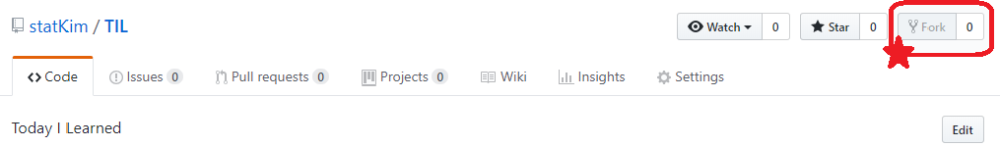

# Git 추가사항


### git push 취소하는 방법

- `git reset HEAD^` : 가장 최근의 commit 삭제

```cmd
# 예시
# 가장 최근의 commit을 취소
$ git reset HEAD^

# commit 사라졌는지 확인
$ git log
```


### git fork 하는 방법

- `fork` 버튼을 누르면 내 repository로 추가됨.



- fork된 repo는 로컬로 다운받아 수정 가능 but 원본 repo는 수정되지 않는다.
- 원본 repo에 contribute하기 위해서는 추가적인 과정이 필요!!

