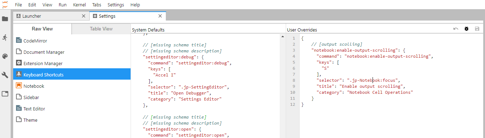

## Jupyter lab 결과창 scrolling하는 단축키 추가하기

- 아래의 코드를 override하면 됨!!

```javascript
// [output scolling]
"notebook:enable-output-scrolling": {
  "command": "notebook:enable-output-scrolling",
  "keys": [
    "S"    // 단축키를 "S"로 하겠다!
  ],
  "selector": ".jp-Notebook:focus",
  "title": "Enable output scrolling",
  "category": "Notebook Cell Operations"
}
```

