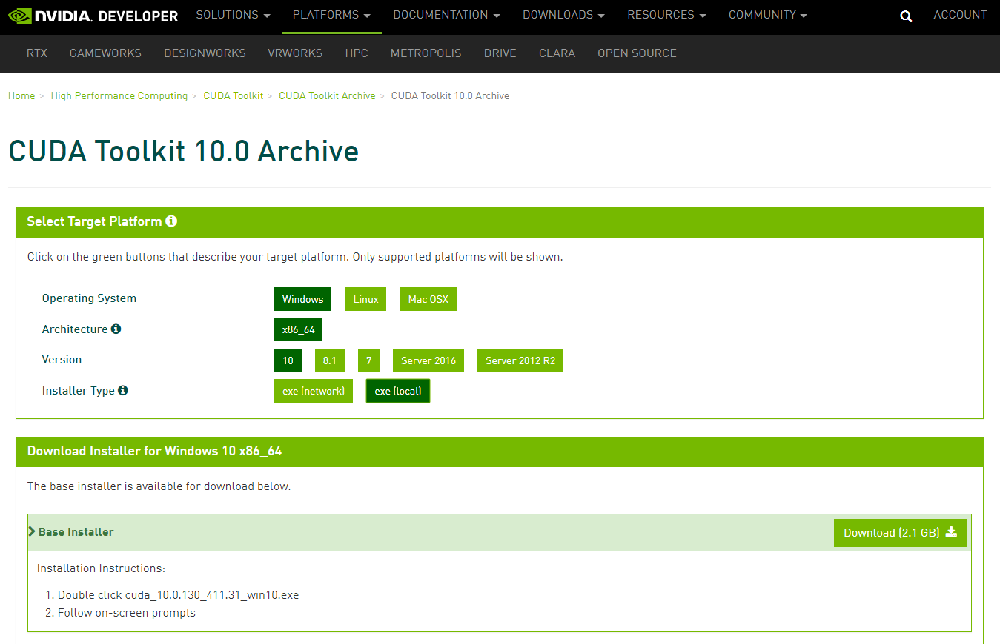
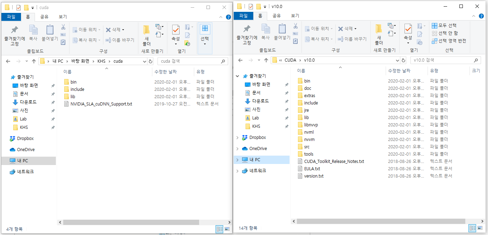
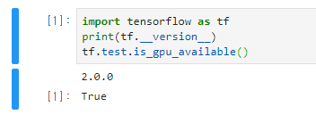

# Tensorflow 2.0 gpu 설치하기


> 컴퓨터 사양
> - 운영체제 : Windows 10
> - GPU : Quadro P600


## 1. NVIDIA driver 설치
**NVIDIA driver Download** : https://www.nvidia.co.kr/Download/index.aspx?lang=kr

- 자신의 GPU에 맞는 드라이버 설치


## 2. CUDA 설치
**CUDA Toolkit Archieve** : https://developer.nvidia.com/cuda-downloads

- 여기서는 CUDA 10.0 설치




## 3. cuDNN 설치

**cuDNN Download** : https://developer.nvidia.com/cudnn

- 회원가입 필요
- CUDA에 맞는 버전 설치(여기서는 cuDNN 10.0 설치)
- 압축해제된 파일들을 CUDA 설치 경로(`C:\Program Files\NVIDIA GPU Computing Toolkit\CUDA`)에 덮어쓰기 



## 4. 가상환경 생성 및 jupyter kernel 생성

- 가상환경 생성
```cmd
conda create --name tf-gpu python=3.7
```

- jupyter kernel 생성
```cmd
activate tf-gpu

conda install ipykernel
python -m ipykernel install --user --name tf-gpu --display-name tf-gpu
```


## 5. Tensorflow 2.0 gpu 설치

```cmd
conda install tensorflow-gpu==2.0.0
```


## 6. 설치 확인

```python
import tensorflow as tf 
print(tf.__version__) 
tf.test.is_gpu_available()
```



## Reference

- https://chan-lab.tistory.com/13
- https://stat-ryan.tistory.com/6
- [https://wordbe.tistory.com/entry/Windows-tensorflow-GPU-설치](https://wordbe.tistory.com/entry/Windows-tensorflow-GPU-설치)
