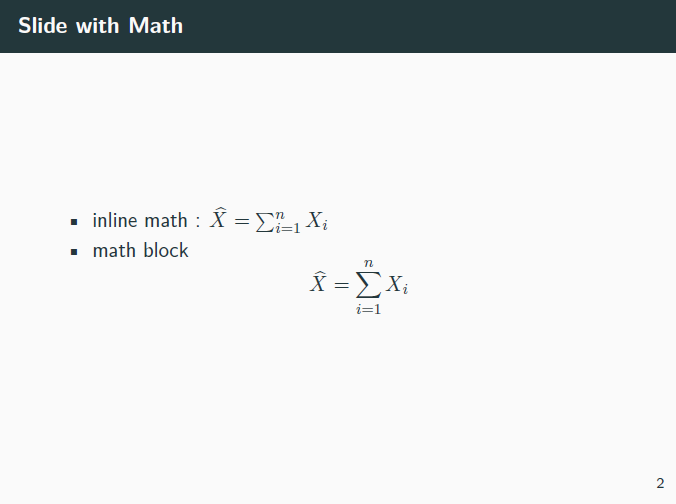
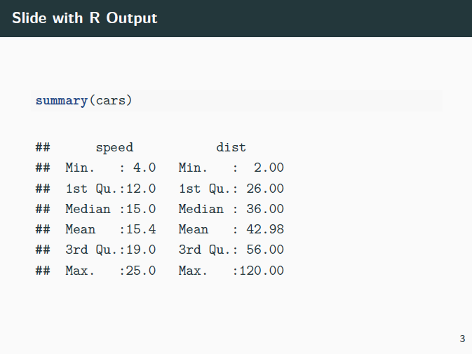
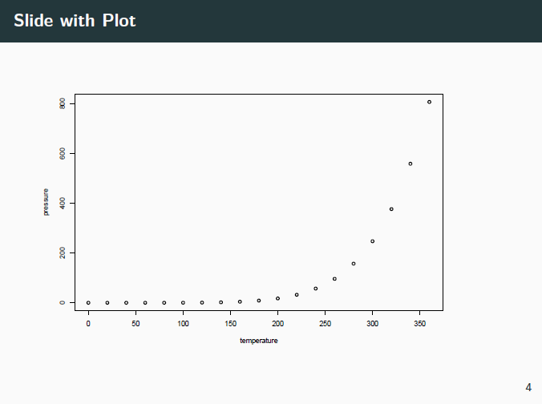

## R markdown에서 Beamer(Tex) 슬라이드 만들기


### R markdown의 header

```yaml
---
title: "Rmarkdown to Beamer"
author: "Hyunsung Kim"
date: December 27, 2019
institute: Department of Statistics \newline Chung-Ang University
fonttheme: "professionalfonts"
output:
  beamer_presentation:
    theme: "metropolis"
---
```

- `title` : 제목
- `author` : 저자이름
- `date` : 날짜
- `institute` : 소속(연구소)
- `fonttheme` : Beamer에서 사용할 폰트(LaTeX 폰트 기준), `professionalfonts`는 수식의 경우 `serif` 폰트로 변환해줌

- `output` : 출력 옵션 결정
  - `theme` : LaTex Beamer의 테마 결정


### 슬라이드 만들기

- 아래와 같이 `##`으로 슬라이드를 구분
- 수식의 경우, LaTeX 코드 사용

```latex
## Slide with Math

- inline math : $\widehat X = \sum_{i=1}^n X_i$
- math block
  $$
  \widehat X = \sum_{i=1}^n X_i
  $$
```




### R output 넣기

```r
## Slide with R Output

​```{r cars, echo = TRUE}
summary(cars)
​```
```




### 그래프 넣기

```r
## Slide with Plot

​```{r pressure}
plot(pressure)
​```
```



