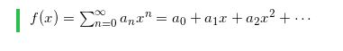

# Github Markdown에 LaTeX 적용하는 방법

### 1. [**Online LaTeX Eqaution Editor**](https://www.codecogs.com/latex/eqneditor.php) 접속

### 2. LaTeX 문법으로 수식 작성

### 3. 하단에서 `URL Encoded`로 변경

### 4. URL 복사

### 5. Github의 markdown editor에 작성

- **``** 를 사용하여 markdown 구문 작성

### 6. 적용되는지 확인!

